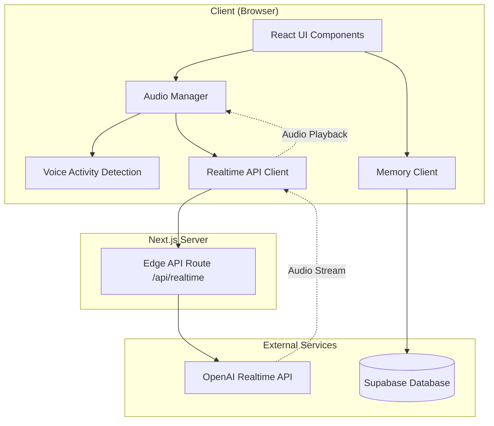

# Design Document

## Overview

Mina is a voice-first assistant application that provides real-time, natural voice conversations with AI assistants. The system architecture is built around three core pillars: real-time audio streaming via OpenAI's Realtime API with WebRTC, persistent conversation memory via Supabase, and a responsive React-based UI with smooth animations.

The application follows a modular architecture with clear separation of concerns: audio handling, LLM integration, memory management, and UI components are isolated into dedicated modules. This design prioritizes low latency (sub-200ms for audio streaming), smooth user experience, and maintainability.

## Architecture

### High-Level Architecture



### Technology Stack

- **Frontend Framework**: Next.js 15 (App Router) with React 19
- **Language**: TypeScript with strict mode
- **Styling**: TailwindCSS 4
- **Animations**: Framer Motion
- **Real-time Communication**: WebRTC + OpenAI Realtime API
- **Database**: Supabase (PostgreSQL)
- **Audio Processing**: Web Audio API + MediaStream API
- **State Management**: React hooks (useState, useEffect, useRef, useContext)

### Key Design Decisions

1. **WebRTC over WebSocket**: Using WebRTC for audio streaming provides lower latency and better audio quality compared to WebSocket-based solutions
2. **Edge API Route**: Implementing the signaling server as a Next.js Edge route keeps the architecture simple and leverages Vercel's edge network
3. **Client-side VAD**: Voice Activity Detection runs in the browser to minimize latency for barge-in detection
4. **Modular Library Structure**: Separating audio, LLM, and memory logic into `/lib` modules enables testing and reusability
5. **Optimistic UI Updates**: UI state changes happen immediately while async operations complete in the background

## Components and Interfaces

### 1. Audio Management Module (`/lib/audio`)

#### MicrophoneHandler

Manages microphone access and audio capture.

```typescript
interface MicrophoneHandler {
  // Request microphone permissions and initialize audio stream
  initialize(): Promise<MediaStream>;

  // Start capturing audio
  startCapture(): void;

  // Stop capturing audio
  stopCapture(): void;

  // Get current audio stream
  getStream(): MediaStream | null;

  // Check if microphone is active
  isActive(): boolean;

  // Clean up resources
  dispose(): void;
}
```

**Implementation Notes**:

- Uses `navigator.mediaDevices.getUserMedia()` for microphone access
- Configures audio constraints for optimal quality (sample rate: 24kHz, channels: mono)
- Handles permission errors gracefully with user-friendly messages
- Implements cleanup to prevent memory leaks

#### VoiceActivityDetector

Detects when the user is speaking using audio analysis.

```typescript
interface VoiceActivityDetectorConfig {
  threshold: number; // Energy threshold for speech detection (0-1)
  minSpeechDuration: number; // Minimum ms of speech to trigger
  silenceDuration: number; // Ms of silence to end speech
}

interface VoiceActivityDetector {
  // Initialize with audio stream
  initialize(stream: MediaStream, config: VoiceActivityDetectorConfig): void;

  // Start monitoring for voice activity
  start(onSpeechStart: () => void, onSpeechEnd: () => void): void;

  // Stop monitoring
  stop(): void;

  // Get current voice activity state
  isSpeaking(): boolean;

  // Clean up resources
  dispose(): void;
}
```

**Implementation Notes**:

- Uses Web Audio API's AnalyserNode for real-time audio analysis
- Calculates RMS (Root Mean Square) energy to detect speech
- Implements debouncing to avoid false positives from background noise
- Configurable thresholds for different environments

#### AudioPlayer

Handles playback of streamed audio from the assistant.

```typescript
interface AudioPlayer {
  // Initialize audio context
  initialize(): void;

  // Queue audio chunk for playback
  queueAudio(audioData: ArrayBuffer): void;

  // Start playback
  play(): void;

  // Pause playback (for barge-in)
  pause(): void;

  // Clear all queued audio
  clearQueue(): void;

  // Check if currently playing
  isPlaying(): boolean;

  // Get current playback position
  getCurrentTime(): number;

  // Clean up resources
  dispose(): void;
}
```

**Implementation Notes**:

- Uses Web Audio API's AudioContext for low-latency playback
- Implements audio buffering to handle network jitter
- Supports immediate pause for barge-in scenarios
- Manages audio queue to ensure smooth continuous playback

### 2. LLM Integration Module (`/lib/llm`)

#### RealtimeClient

Manages connection and communication with OpenAI Realtime API.

```typescript
interface RealtimeClientConfig {
  apiKey: string;
  model: string;
  voice: string;
  instructions: string;
  temperature: number;
}

interface RealtimeClient {
  // Initialize connection to Realtime API
  connect(config: RealtimeClientConfig): Promise<void>;

  // Send audio input to the API
  sendAudio(audioData: ArrayBuffer): void;

  // Register callback for receiving audio responses
  onAudioResponse(callback: (audio: ArrayBuffer) => void): void;

  // Register callback for transcription updates
  onTranscript(callback: (text: string, isFinal: boolean) => void): void;

  // Interrupt current assistant response
  interrupt(): void;

  // Update session configuration
  updateSession(config: Partial<RealtimeClientConfig>): void;

  // Disconnect from API
  disconnect(): void;

  // Get connection status
  getStatus(): "disconnected" | "connecting" | "connected" | "error";
}
```

**Implementation Notes**:

- Establishes WebRTC connection via WHIP (WebRTC-HTTP Ingestion Protocol)
- Handles connection lifecycle (connecting, connected, reconnecting, disconnected)
- Implements automatic reconnection with exponential backoff
- Manages session state and configuration updates
- Processes incoming audio chunks and forwards to AudioPlayer

#### AssistantManager

Loads and manages assistant configurations.

```typescript
interface AssistantProfile {
  id: string;
  name: string;
  description: string;
  voice: string; // OpenAI voice ID (e.g., "alloy", "echo", "nova")
  personality: string; // System instructions for the assistant
  avatarColor: string; // Hex color for UI
  accentColor: string; // Neon accent color
}

interface AssistantManager {
  // Load assistants from configuration file
  loadAssistants(): Promise<AssistantProfile[]>;

  // Get assistant by ID
  getAssistant(id: string): AssistantProfile | null;

  // Get all assistants
  getAllAssistants(): AssistantProfile[];
}
```

**Implementation Notes**:

- Loads assistant configurations from `assistants.json` at build time
- Validates assistant data structure
- Provides type-safe access to assistant profiles

### 3. Memory Management Module (`/lib/memory`)

#### MemoryClient

Manages conversation memory storage in Supabase.

```typescript
interface Session {
  id: string;
  assistantId: string;
  userId?: string;
  startedAt: Date;
  endedAt?: Date;
  summary?: string;
  recentTopics: string[];
}

interface MemoryClient {
  // Initialize Supabase client
  initialize(supabaseUrl: string, supabaseKey: string): void;

  // Create new session
  createSession(assistantId: string, userId?: string): Promise<Session>;

  // Update session with conversation data
  updateSession(sessionId: string, data: Partial<Session>): Promise<void>;

  // End session
  endSession(sessionId: string, summary: string, topics: string[]): Promise<void>;

  // Get most recent session for an assistant
  getLastSession(assistantId: string, userId?: string): Promise<Session | null>;

  // Get session history
  getSessionHistory(assistantId: string, userId?: string, limit?: number): Promise<Session[]>;
}
```

**Implementation Notes**:

- Uses Supabase JavaScript client for database operations
- Implements error handling for network failures
- Supports optional user authentication
- Optimizes queries with proper indexing

### 4. UI Components

#### AssistantCarousel

Horizontal scrollable carousel for selecting assistants.

```typescript
interface AssistantCarouselProps {
  assistants: AssistantProfile[];
  selectedId: string | null;
  onSelect: (assistant: AssistantProfile) => void;
}
```

**Features**:

- Smooth horizontal scrolling with touch/mouse support
- Animated selection state with Framer Motion
- Responsive card design with avatar, name, and description
- Neon glow effect on selected assistant

#### CallButton

Large, prominent button to initiate voice calls.

```typescript
interface CallButtonProps {
  isEnabled: boolean;
  isActive: boolean;
  onClick: () => void;
}
```

**Features**:

- Animated pulse effect when enabled
- Visual feedback on press
- Disabled state when no assistant selected
- Transforms to "End Call" button during active session

#### SessionRecap

Displays summary of previous conversation.

```typescript
interface SessionRecapProps {
  session: Session | null;
  assistantName: string;
}
```

**Features**:

- Fade-in animation when displayed
- Formatted list of recent topics
- Dismissible with smooth exit animation

#### CallInterface

Main interface during an active voice session.

```typescript
interface CallInterfaceProps {
  assistant: AssistantProfile;
  onEndCall: () => void;
}
```

**Features**:

- Real-time audio waveform visualization
- Speaking indicator (user vs assistant)
- Live transcript display
- End call button

### 5. API Routes

#### `/api/realtime` (Edge Route)

Handles WebRTC signaling and session management.

```typescript
// POST /api/realtime
interface RealtimeRequest {
  assistantId: string;
  sessionContext?: {
    summary: string;
    recentTopics: string[];
  };
}

interface RealtimeResponse {
  sessionId: string;
  ephemeralKey: string;
}
```

**Implementation Notes**:

- Deployed as Edge function for low latency
- Generates ephemeral API keys for client-side Realtime API access
- Injects session context into system instructions
- Implements rate limiting to prevent abuse

## Data Models

### Database Schema (Supabase)

#### sessions table

```sql
CREATE TABLE sessions (
  id UUID PRIMARY KEY DEFAULT gen_random_uuid(),
  assistant_id TEXT NOT NULL,
  user_id TEXT,
  started_at TIMESTAMPTZ NOT NULL DEFAULT NOW(),
  ended_at TIMESTAMPTZ,
  summary TEXT,
  recent_topics TEXT[] DEFAULT '{}',
  created_at TIMESTAMPTZ NOT NULL DEFAULT NOW(),
  updated_at TIMESTAMPTZ NOT NULL DEFAULT NOW()
);

CREATE INDEX idx_sessions_assistant_user ON sessions(assistant_id, user_id, started_at DESC);
CREATE INDEX idx_sessions_user ON sessions(user_id, started_at DESC);
```

### Configuration Files

#### assistants.json

```json
{
  "assistants": [
    {
      "id": "mina-creative",
      "name": "Mina Creative",
      "description": "Your creative brainstorming partner",
      "voice": "nova",
      "personality": "You are Mina Creative, an enthusiastic and imaginative AI assistant...",
      "avatarColor": "#8B5CF6",
      "accentColor": "#A78BFA"
    }
  ]
}
```

## Error Handling

### Error Categories

1. **Microphone Access Errors**
   - Permission denied: Show modal explaining why mic access is needed
   - Device not found: Suggest checking system settings
   - Already in use: Inform user to close other apps using microphone

2. **Network Errors**
   - Connection failed: Retry with exponential backoff (max 3 attempts)
   - Connection lost: Show reconnecting indicator, attempt to resume
   - Timeout: Display error and option to retry

3. **API Errors**
   - Rate limit exceeded: Show friendly message and suggest trying later
   - Invalid API key: Log error (dev only), show generic error to user
   - Service unavailable: Retry with backoff, fallback to error state

4. **Memory Errors**
   - Database connection failed: Continue session without memory (graceful degradation)
   - Query timeout: Log warning, return null for session history
   - Write failure: Log error but don't interrupt active session

### Error Recovery Strategies

- **Automatic Retry**: Network and transient errors retry automatically with exponential backoff
- **Graceful Degradation**: Memory features degrade gracefully if Supabase is unavailable
- **User Notification**: Critical errors show user-friendly messages with actionable steps
- **Logging**: All errors logged to console (dev) and error tracking service (production)

## Testing Strategy

### Unit Tests

**Audio Module**:

- MicrophoneHandler: Test initialization, capture start/stop, cleanup
- VoiceActivityDetector: Test speech detection with mock audio data
- AudioPlayer: Test queueing, playback, pause, and clear operations

**LLM Module**:

- RealtimeClient: Test connection lifecycle, audio sending, response handling
- AssistantManager: Test loading and retrieving assistant profiles

**Memory Module**:

- MemoryClient: Test CRUD operations with mock Supabase client

### Integration Tests

- **End-to-End Call Flow**: Test complete flow from assistant selection to call end
- **Barge-in Behavior**: Verify audio pause when user speaks during assistant response
- **Memory Persistence**: Verify session data is correctly saved and retrieved
- **Error Recovery**: Test reconnection logic and graceful degradation

### Manual Testing Checklist

- [ ] Microphone permission flow on first use
- [ ] Assistant selection and carousel interaction
- [ ] Call initiation and WebRTC connection
- [ ] Real-time audio streaming quality
- [ ] Barge-in responsiveness
- [ ] Session recap display
- [ ] Call termination and cleanup
- [ ] UI responsiveness on mobile devices
- [ ] Dark mode appearance
- [ ] Animation smoothness

## Performance Considerations

### Latency Optimization

- **Audio Streaming**: Target <200ms end-to-end latency
  - Use WebRTC for direct peer connection
  - Minimize audio buffering (50-100ms buffer)
  - Deploy Edge API route close to users

- **UI Responsiveness**: Target <16ms frame time (60 FPS)
  - Use CSS transforms for animations (GPU-accelerated)
  - Debounce expensive operations
  - Lazy load non-critical components

### Resource Management

- **Memory**: Clean up audio contexts and streams on component unmount
- **Network**: Close WebRTC connections properly to avoid hanging connections
- **Battery**: Optimize VAD to minimize CPU usage on mobile devices

### Scalability

- **Database**: Index sessions table for fast queries by assistant and user
- **API**: Implement rate limiting on Edge route (10 requests/minute per IP)
- **Caching**: Cache assistant configurations at build time

## Security Considerations

- **API Keys**: Never expose OpenAI API key in client code; use Edge route for key management
- **Ephemeral Keys**: Generate short-lived keys for Realtime API access (5-minute expiry)
- **Input Validation**: Validate all user inputs and API responses
- **CORS**: Configure strict CORS policies for API routes
- **Content Security Policy**: Implement CSP headers to prevent XSS attacks
- **Rate Limiting**: Protect API routes from abuse with rate limiting
- **User Privacy**: Store minimal user data; implement data retention policies

## Deployment Architecture

### Development Environment

- Local Next.js dev server with hot reload
- Mock Supabase instance or development database
- Environment variables in `.env.local`

### Production Environment

- Deploy to Vercel for optimal Next.js performance
- Edge API routes deployed to Vercel Edge Network
- Supabase production instance with connection pooling
- Environment variables configured in Vercel dashboard
- CDN caching for static assets

### Environment Variables

```
NEXT_PUBLIC_SUPABASE_URL=https://xxx.supabase.co
NEXT_PUBLIC_SUPABASE_ANON_KEY=xxx
OPENAI_API_KEY=sk-xxx
NEXT_PUBLIC_APP_URL=https://mina.app
```

## Future Enhancements

- **Multi-language Support**: Detect user language and respond accordingly
- **Voice Customization**: Allow users to adjust assistant voice parameters
- **Conversation Export**: Enable users to download conversation transcripts
- **Advanced Memory**: Implement vector embeddings for semantic memory search
- **Group Conversations**: Support multiple users in a single voice session
- **Mobile Apps**: Native iOS/Android apps for better performance
- **Analytics**: Track usage metrics and conversation quality
